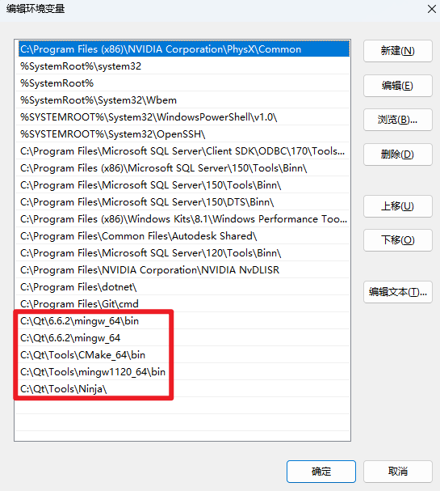
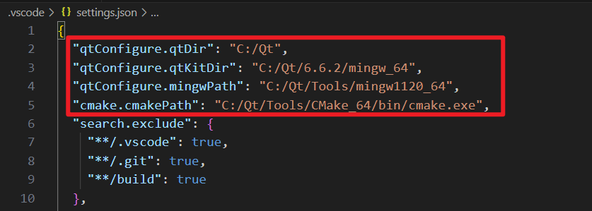

# 安装 QT 开源版本（使用个账号注册）

# 设置 Wodows 环境变量



# 修改.vscode/settings.json

- 设置 QT 插件变量



- 设置 clangd 配置变量

# git 支持中文文件

```bash
git config --global core.quotepath false
git config --global core.autocrlf input
```
